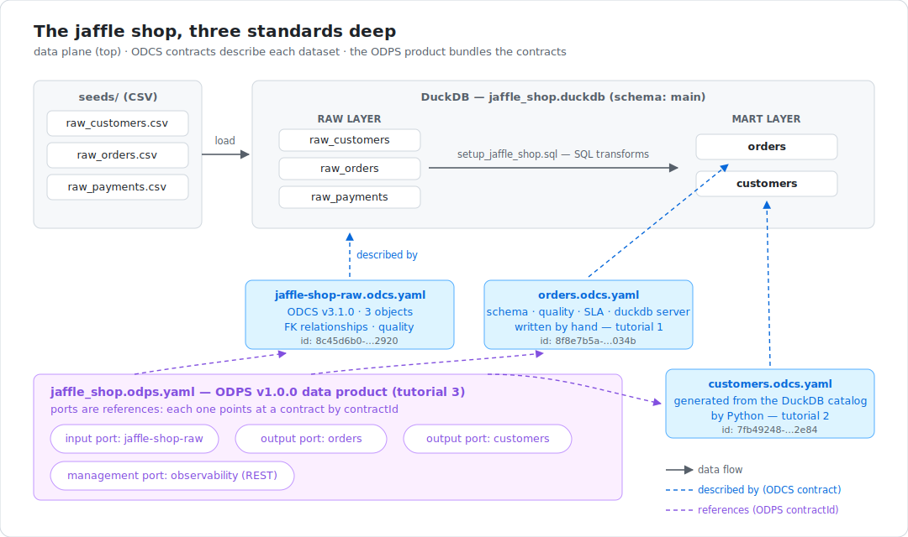
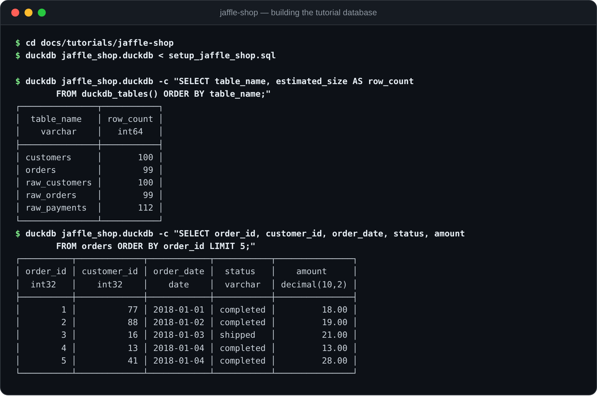

# Tutorials: the Bitol skills, hands-on with DuckDB and the jaffle shop

Three tutorials, one per skill, all built around the same tiny-but-real
analytics project: the classic **jaffle shop** — a fictional restaurant whose
app database (customers, orders, payments) is transformed into two analytics
marts. The dataset is small enough to fit in your head and rich enough to
exercise every part of the standards.

| Tutorial | Skill | What you build |
|---|---|---|
| [1. Write a data contract](odcs-yaml.md) | [`odcs-yaml`](../../skills/odcs-yaml/) | An ODCS v3.1.0 contract for the `orders` mart, with schema, quality rules you run against the real data, an SLA, and a DuckDB server binding — then validate it. |
| [2. Contracts in Python](odcs-python.md) | [`odcs-python`](../../skills/odcs-python/) | A script that *generates* the `customers` contract from DuckDB's catalog using the `open-data-contract-standard` Pydantic model. |
| [3. Package a data product](odps-yaml.md) | [`odps-yaml`](../../skills/odps-yaml/) | An ODPS v1.0.0 data product that bundles the contracts into input/output ports with lineage. |

The tutorials build on each other in order, but each states what it needs, so
you can also jump straight to the one you care about.



## Two ways to follow along

These skills exist to teach **AI agents** the Bitol standards. So every
tutorial is written for two readers at once:

- **With an agent** (recommended): install the skill into Claude Code or any
  agent framework that consumes [agentskills.io](https://agentskills.io/specification)
  skills (see the [repo README](../../README.md#installing-a-skill)), then use
  the *"Ask your agent"* prompts sprinkled through each tutorial. The point of
  the tutorials is that you can check the agent's output — you'll know what a
  correct contract looks like because you built one yourself.
- **By hand**: every step is a plain command or YAML block you can run and
  write yourself. No agent required.

## Setup (10 minutes)

You need DuckDB and, for validation and tutorial 2, [uv](https://docs.astral.sh/uv/)
(any recent Python with `duckdb`, `pyyaml`, `jsonschema`, and
`open-data-contract-standard` installed works too — `uv run --with …` just
saves you the environment management).

Clone this repo and build the jaffle shop database from the vendored seeds:

```bash
cd docs/tutorials/jaffle-shop

# with the DuckDB CLI (https://duckdb.org/docs/installation/):
duckdb jaffle_shop.duckdb < setup_jaffle_shop.sql

# or without the CLI, via the DuckDB Python package:
uv run --with duckdb python -c "import duckdb, pathlib; \
    duckdb.connect('jaffle_shop.duckdb').sql(pathlib.Path('setup_jaffle_shop.sql').read_text())"
```

[`setup_jaffle_shop.sql`](jaffle-shop/setup_jaffle_shop.sql) loads three seed
CSVs as **raw tables** — untouched copies of the shop app's database — and
derives two **marts** the way dbt's classic jaffle shop project does:

| Table | Layer | Grain |
|---|---|---|
| `raw_customers` | raw | one row per registered customer (`id`, `first_name`, `last_name`) |
| `raw_orders` | raw | one row per order (`id`, `user_id`, `order_date`, `status`) |
| `raw_payments` | raw | one row per payment, amounts in integer cents; an order can have several |
| `orders` | mart | one row per order, with the paid amount pivoted per payment method in USD |
| `customers` | mart | one row per customer, with order history rolled up (first/latest order, count, lifetime value) |

Check what you built:

```sql
-- duckdb jaffle_shop.duckdb
SELECT table_name, estimated_size AS row_count FROM duckdb_tables() ORDER BY table_name;
SELECT * FROM orders ORDER BY order_id LIMIT 5;
```



That's the whole data platform. Now head to
[tutorial 1](odcs-yaml.md) to put a contract on it.

## What's in this directory

```
docs/tutorials/
  README.md            # this file
  odcs-yaml.md         # tutorial 1 — write and validate a data contract
  odcs-python.md       # tutorial 2 — generate a contract from DuckDB in Python
  odps-yaml.md         # tutorial 3 — package contracts into a data product
  images/              # diagrams and screenshots used by the tutorials
  jaffle-shop/
    seeds/             # raw_customers.csv, raw_orders.csv, raw_payments.csv
    setup_jaffle_shop.sql
    scripts/
      generate_contract.py   # built in tutorial 2
    contracts/         # the finished artifacts each tutorial builds
      jaffle-shop-raw.odcs.yaml   # raw layer (3 objects, FK relationships)
      orders.odcs.yaml            # built step-by-step in tutorial 1
      customers.odcs.yaml         # GENERATED by tutorial 2's script
      jaffle_shop.odps.yaml       # built step-by-step in tutorial 3
```

The finished contracts are committed, so you can diff your work against them
at any point — and the repo's test suite validates them against the vendored
schemas, so they stay correct as the specs evolve.

> **About the data**: the seeds are a deterministic, synthetic reproduction of
> [dbt-labs' classic `jaffle_shop`](https://github.com/dbt-labs/jaffle_shop)
> seed data — same tables, same columns, same shapes (integer-cent amounts,
> 2018 order dates, five order statuses, four payment methods), freshly
> generated rows. Any resemblance to real jaffles is coincidental.
