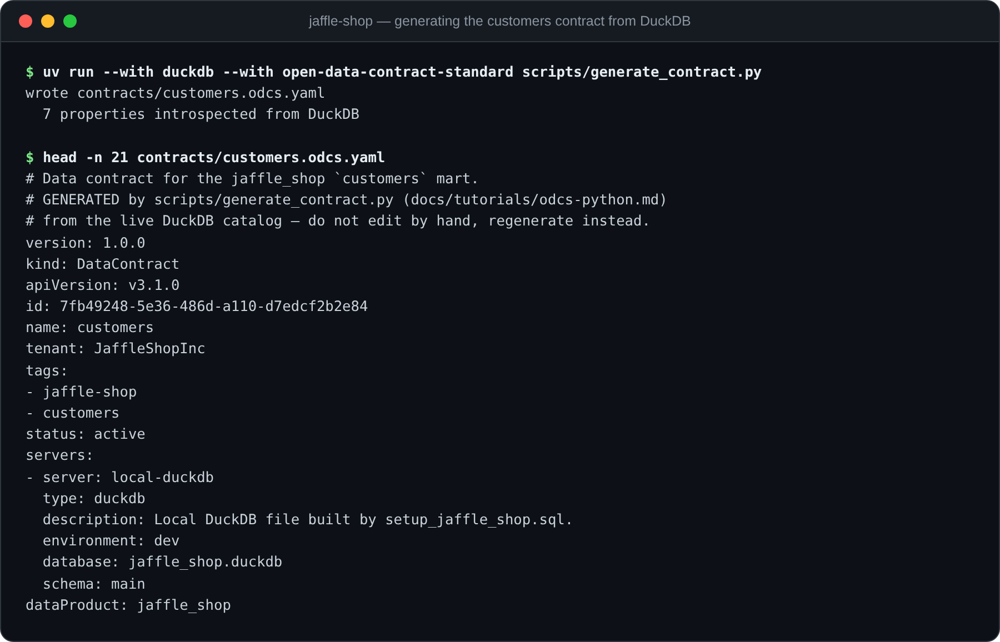

# Tutorial 2 — Generate the `customers` contract from DuckDB in Python (`odcs-python`)

In [tutorial 1](odcs-yaml.md) you wrote a contract by hand. That's the right
way to learn the format — and the wrong way to maintain fifty of them. This
tutorial flips the direction: a Python script **introspects the live
`customers` mart in DuckDB and generates its ODCS contract**, using the
official [`open-data-contract-standard`](https://pypi.org/project/open-data-contract-standard/)
package.

**Skill showcased**: [`odcs-python`](../../skills/odcs-python/). It teaches
your agent the package's Pydantic model tree, the spec→pip version map, and —
above all — the alias gotchas you're about to meet.

**You need**: the DuckDB database from the [setup](README.md#setup-10-minutes)
and `uv`. Tutorial 1 is helpful context but not required.

The finished script is committed at
[`jaffle-shop/scripts/generate_contract.py`](jaffle-shop/scripts/generate_contract.py);
its output at
[`jaffle-shop/contracts/customers.odcs.yaml`](jaffle-shop/contracts/customers.odcs.yaml).

> **🤖 Ask your agent** (with `odcs-python` installed):
> *"Write a Python script that introspects the `customers` table in
> `jaffle_shop.duckdb` and generates an ODCS v3.1.0 contract for it with the
> open-data-contract-standard package."*
>
> Watch whether it constructs the contract with `schema=` and reads it back
> with `.schema_` — that's the gotcha that separates an agent that knows this
> package from one that's guessing.

## 1. Install the right version

The pip module's version tracks the spec's major.minor **but not the patch**:

| ODCS spec | pip module |
|---|---|
| 3.0.1 | `>=3.0.1` |
| 3.0.2 | `>=3.0.4` ← not 3.0.2! |
| 3.1.0 | `>=3.1.0` |

We target spec v3.1.0, so anything `>=3.1.0` works. The tutorial commands use
`uv run --with open-data-contract-standard`, which grabs the latest.

## 2. Parse tutorial 1's contract — and meet `schema_`

Start by loading the contract you already have. Validation is *implicit* in
this package: parsing **is** validating (there is no separate `.validate()`).

```bash
cd docs/tutorials/jaffle-shop
uv run --with open-data-contract-standard python
```

```python
>>> from open_data_contract_standard.model import OpenDataContractStandard
>>> contract = OpenDataContractStandard.from_file("contracts/orders.odcs.yaml")
>>> contract.id, contract.apiVersion, contract.status
('8f8e7b5a-5fd8-4d35-bd8e-1177136c034b', 'v3.1.0', 'active')
>>> [p.name for p in contract.schema_[0].properties]
['order_id', 'customer_id', 'order_date', 'status', 'credit_card_amount',
 'coupon_amount', 'bank_transfer_amount', 'gift_card_amount', 'amount']
```

That trailing underscore is the package's most famous quirk: `schema` collides
with a Pydantic built-in, so the field is `schema_` with a YAML alias. The
rules (all four matter):

- **YAML** always says `schema:` — the alias.
- **Reading** the model: `contract.schema_`.
- **Constructing**: pass `schema=` (the alias). `schema_=` raises
  `ValidationError` — the model doesn't enable `populate_by_name`, and the
  root model's `extra='forbid'` rejects the unknown name.
- **Serializing**: `to_yaml()` emits `schema:` again automatically.

## 3. Introspect DuckDB

DuckDB will happily tell us the physical shape of the mart — the same
`DESCRIBE` you ran by eye in tutorial 1, now consumed programmatically:

```python
import duckdb

with duckdb.connect("jaffle_shop.duckdb", read_only=True) as con:
    rows = con.sql("DESCRIBE customers").fetchall()
# [('customer_id', 'INTEGER', 'YES', None, None, None), ('first_name', 'VARCHAR', ...), ...]
```

Map DuckDB's types onto ODCS logical types and build one `SchemaProperty` per
column:

```python
from open_data_contract_standard.model import SchemaProperty

LOGICAL_TYPES = {"INTEGER": "integer", "BIGINT": "integer", "DOUBLE": "number",
                 "DATE": "date", "TIMESTAMP": "timestamp", "BOOLEAN": "boolean",
                 "VARCHAR": "string"}

def logical_type(duckdb_type: str) -> str:
    if duckdb_type.startswith("DECIMAL"):
        return "number"
    return LOGICAL_TYPES.get(duckdb_type, "string")

properties = [
    SchemaProperty(
        name=column_name,
        logicalType=logical_type(column_type),
        physicalType=column_type,          # keep the exact DuckDB type
        primaryKey=column_name == "customer_id",
        required=column_name in REQUIRED,  # business knowledge, see below
    )
    for column_name, column_type, *_ in rows
]
```

Introspection only gets you the mechanical half. The catalog cannot tell you
that `first_order` is legitimately null for customers who never ordered, or
what `customer_lifetime_value` means in business terms — in the
[finished script](jaffle-shop/scripts/generate_contract.py) that context lives
in a small hand-written `DESCRIPTIONS`/`REQUIRED` block that gets merged in.
Generated structure, curated meaning.

## 4. Assemble and serialize the contract

```python
from open_data_contract_standard.model import (
    Description, OpenDataContractStandard, SchemaObject, Server,
)

contract = OpenDataContractStandard(
    apiVersion="v3.1.0",
    kind="DataContract",
    id="7fb49248-5e36-486d-a110-d7edcf2b2e84",
    name="customers",
    version="1.0.0",
    status="active",
    domain="jaffle-shop",
    dataProduct="jaffle_shop",
    description=Description(
        purpose="One row per customer with rolled-up order history.",
        limitations="Includes customers with zero orders; date columns are null for them.",
        usage="Customer segmentation, retention analysis, lifetime-value reporting.",
    ),
    schema=[SchemaObject(               # ← the alias, NOT schema_=
        name="customers",
        physicalName="customers",
        physicalType="table",
        properties=properties,
    )],
    servers=[Server(server="local-duckdb", type="duckdb", environment="dev",
                    database="jaffle_shop.duckdb", schema="main")],
)

print(contract.to_yaml())
```

`to_yaml()` dumps with `exclude_none=True, exclude_defaults=True, by_alias=True`:
unset fields vanish, and `schema_` comes out as `schema:`. Don't be surprised
that output is *smaller* than what a round-tripped input file was — dropped
`null`s are by design.

One more alias, sharper than `schema`: `Relationship`. Its YAML field `from`
is a Python keyword, so it can't be a kwarg at all — and
`Relationship(from_=...)` does **not** error, it *silently drops the value*
(child models ignore unknown kwargs; only the root model forbids them). Build
relationships from dicts instead:

```python
from open_data_contract_standard.model import Relationship
rel = Relationship.model_validate({"from": ["orders.customer_id"],
                                   "to": ["customers.customer_id"],
                                   "type": "foreignKey"})
```

## 5. Run the real script

The committed script wraps steps 3–4 with the hand-curated business context
and a round-trip sanity check (`from_string(contract.to_yaml())` — what we
write must parse back):

```bash
cd docs/tutorials/jaffle-shop
uv run --with duckdb --with open-data-contract-standard scripts/generate_contract.py
```

```text
wrote contracts/customers.odcs.yaml
  7 properties introspected from DuckDB
```



The Pydantic model marks *every* field optional, so "it constructed" doesn't
prove required fields are present — finish with the two-layer validator from
tutorial 1, whose JSON Schema pass does enforce them:

```bash
cd ../../..   # repo root
uv run --with open-data-contract-standard \
    skills/odcs-yaml/scripts/validate_contract.py \
    docs/tutorials/jaffle-shop/contracts/customers.odcs.yaml
```

```text
OK (pydantic + jsonschema against v3.1.0): docs/tutorials/jaffle-shop/contracts/customers.odcs.yaml
```

Regenerate any time the mart changes shape: rerun the script, diff the YAML,
bump the contract `version`. That's schema-drift detection with a five-line
Makefile target.

## 6. Read a `ValidationError` like a local

When parsing fails, Pydantic tells you exactly where and why — if you know
how to read it. Feed it a contract with two classic mistakes, a v2 field name
and a mistyped boolean:

```python
from open_data_contract_standard.model import OpenDataContractStandard
from pydantic import ValidationError

bad = """
apiVersion: v3.1.0
kind: DataContract
id: 7fb49248-5e36-486d-a110-d7edcf2b2e84
version: 1.0.0
status: active
datasetDomain: jaffle-shop        # v2 field name!
schema:
  - name: customers
    properties:
      - name: customer_id
        required: "yes please"    # not a boolean
"""
try:
    OpenDataContractStandard.from_string(bad)
except ValidationError as e:
    for err in e.errors():
        print(err["loc"], err["type"], "-", err["msg"])
```

```text
('schema', 0, 'properties', 0, 'required') bool_parsing - Input should be a valid boolean, unable to interpret input
('datasetDomain',) extra_forbidden - Extra inputs are not permitted
```

`loc` is a path through the YAML (`schema → object 0 → property 0 →
required`); `type` is the error class. `extra_forbidden` at the top level
almost always means one of: a typo, a **v2 field name** (`datasetDomain`,
`columns`, `isNullable`, …), or a custom extension that belongs under
`customProperties`.

## Recap

You parsed a contract, introspected DuckDB's catalog into `SchemaProperty`
objects, assembled and serialized a full contract programmatically (dodging
the `schema`/`schema_` and `from`/`from_` alias traps), validated the result,
and learned to read `ValidationError` output.

More prompts to try against your `odcs-python`-equipped agent:

> *"Extend generate_contract.py to cover every table in the database, one
> contract per mart, skipping the raw tables."*
>
> *"Write a pytest that fails if contracts/customers.odcs.yaml no longer
> matches what generate_contract.py produces from the live database."*
>
> *"Why does `contract.schema` give me a bound method instead of my schema?"*

Next: [tutorial 3](odps-yaml.md) packages both marts' contracts into a
**data product** with ODPS.
