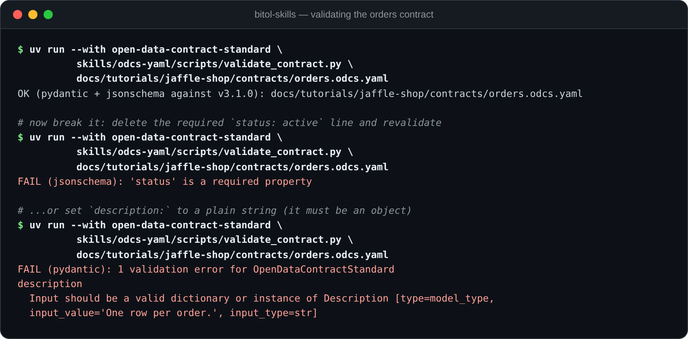

# Tutorial 1: Write a data contract for the `orders` mart (`odcs-yaml`)

You built the jaffle shop database in the [setup](README.md#setup-10-minutes).
Its most valuable table is the `orders` mart, one row per order, with the
paid amount pivoted per payment method. In this tutorial you put an
ODCS v3.1.0 data contract on it: a YAML document that declares the mart's
structure, quality guarantees, SLA, ownership, and where it physically lives,
and that a machine can validate.

**Skill**: [`odcs-yaml`](../../skills/odcs-yaml/). Install it and
your agent knows the spec: every field below, the version differences, the
pitfalls, and how to validate what it writes.

**You need**: the DuckDB database from the [setup](README.md#setup-10-minutes),
`uv`, and this repo checked out (the validator and the vendored JSON Schemas
live in the `odcs-yaml` skill folder).

The finished contract is committed at
[`jaffle-shop/contracts/orders.odcs.yaml`](jaffle-shop/contracts/orders.odcs.yaml).
Diff your work against it at any point.

> **Ask your agent** (with `odcs-yaml` installed):
> *"Write an ODCS v3.1.0 data contract for the `orders` table in
> `docs/tutorials/jaffle-shop/jaffle_shop.duckdb`. Inspect the table first,
> add quality rules for the primary key and the status values, and validate
> the result."*
>
> The rest of this tutorial is what a correct answer looks like, one section
> at a time.

## 1. Look at what you're contracting

A contract describes a dataset, so start from the dataset:

```sql
-- duckdb jaffle_shop.duckdb
DESCRIBE orders;
```

```text
┌──────────────────────┬───────────────┬─────────┐
│     column_name      │  column_type  │  null   │
├──────────────────────┼───────────────┼─────────┤
│ order_id             │ INTEGER       │ YES     │
│ customer_id          │ INTEGER       │ YES     │
│ order_date           │ DATE          │ YES     │
│ status               │ VARCHAR       │ YES     │
│ credit_card_amount   │ DECIMAL(10,2) │ YES     │
│ coupon_amount        │ DECIMAL(10,2) │ YES     │
│ bank_transfer_amount │ DECIMAL(10,2) │ YES     │
│ gift_card_amount     │ DECIMAL(10,2) │ YES     │
│ amount               │ DECIMAL(10,2) │ YES     │
└──────────────────────┴───────────────┴─────────┘
```

Note what the catalog can *not* tell you: that `order_id` is the primary key,
that `status` has exactly five legal values, that amounts are USD, that the
mart refreshes daily. That gap is what the contract is for: everything the
consumer needs to know that the database itself doesn't enforce.

## 2. Fundamentals: identity of the contract itself

Create `orders.odcs.yaml` and start with who, what, and which version.
This is metadata about the *contract*, not the data:

```yaml
apiVersion: v3.1.0        # version of the ODCS standard
kind: DataContract
id: 8f8e7b5a-5fd8-4d35-bd8e-1177136c034b   # stable unique id (a UUID)
name: orders
version: 1.0.0            # version of THIS contract (semver)
status: active            # proposed | draft | active | deprecated | retired

domain: jaffle-shop
dataProduct: jaffle_shop
tenant: JaffleShopInc

description:
  purpose: One row per order, with the order lifecycle status and the paid amount broken down by payment method.
  limitations: Only orders that reached the shop system are included; abandoned carts are not. Amounts are in USD.
  usage: Revenue reporting, order-status dashboards, and joining customer activity to payments.
```

Two things people get wrong on line one:

- `apiVersion`, `kind`, `id`, `version`, and `status` are the only required
  fields; `name` is optional (`id` is the identifier).
- `description` is an object with `purpose` / `limitations` / `usage`
  sub-keys, not a string. `description: "One row per order"` fails validation
  (we'll prove it in step 7).

## 3. Schema: objects and properties, logical and physical

ODCS v3 doesn't say "tables and columns". It says *objects* (a structure of
data: table, document, Kafka payload) containing *properties* (its
attributes). For our relational mart that's one object with nine properties.
Each property carries a platform-agnostic `logicalType` *and* the
platform-specific `physicalType` you saw in `DESCRIBE`:

```yaml
schema:
  - name: orders
    physicalName: orders
    physicalType: table
    businessName: Jaffle Shop orders
    description: Fact table with one row per order placed in the jaffle shop.
    dataGranularityDescription: One row per order (order_id is unique).
    properties:
      - name: order_id
        businessName: Order identifier
        logicalType: integer      # platform-agnostic
        physicalType: INTEGER     # what DuckDB actually stores
        description: Primary key of the order.
        primaryKey: true
        primaryKeyPosition: 1
        required: true            # = NOT NULL. Inverse of v2's isNullable!
        unique: true
        examples: [1, 99]
      - name: customer_id
        logicalType: integer
        physicalType: INTEGER
        description: The customer who placed the order. Joins to the customers mart.
        required: true
      - name: order_date
        logicalType: date
        physicalType: DATE
        description: Calendar date the order was placed.
        required: true
        examples: ["2018-01-01"]
      - name: status
        logicalType: string
        physicalType: VARCHAR
        description: Lifecycle status of the order.
        required: true
      # ... the five DECIMAL(10,2) amount properties follow the same pattern;
      # see the finished contract for all of them.
```

The amount properties introduce one more idea: the contract can document
where a value comes from. `amount` is not stored in `raw_orders`; the
[setup SQL](jaffle-shop/setup_jaffle_shop.sql) computes it from `raw_payments`.
Say so:

```yaml
      - name: amount
        businessName: Order total
        logicalType: number
        physicalType: DECIMAL(10,2)
        description: Total paid for the order across all payment methods, in USD.
        required: true
        transformSourceObjects: [raw_payments]
        transformLogic: SUM(amount) / 100.0, per order
```

## 4. Quality: promises you can execute

This is where a contract earns its keep. ODCS v3.1.0 ships a small library
of predefined metrics (`rowCount`, `nullValues`, `invalidValues`,
`duplicateValues`, `missingValues`) plus escape hatches for raw SQL and
vendor-specific engines. Attach rules at the property level:

```yaml
      - name: order_id
        # ...as above, plus:
        quality:
          - id: order_id_not_null
            metric: nullValues
            mustBe: 0
            description: Every order carries an identifier.
          - id: order_id_unique
            metric: duplicateValues
            mustBe: 0
            description: order_id is the primary key and must be unique.
      - name: status
        # ...as above, plus:
        quality:
          - id: status_valid_values
            metric: invalidValues
            arguments:
              validValues: [placed, shipped, completed, return_pending, returned]
            mustBe: 0
            description: Status must be one of the five known lifecycle values.
```

…and at the schema (object) level, where `sql` rules can express anything the
library can't. Here, that the mart reconciles with the raw payments ledger.
In `sql` rules, `{object}` and `{property}` are placeholders the quality
engine replaces with the current table and column:

```yaml
    quality:                       # sibling of `properties`, on the object
      - id: orders_row_count
        metric: rowCount
        mustBeGreaterThan: 0
        description: The mart must never be published empty.
      - id: orders_amount_reconciles
        type: sql
        query: |
          SELECT ABS(
            (SELECT SUM(amount) FROM {object}) -
            (SELECT SUM(amount) / 100.0 FROM raw_payments)
          )
        mustBeLessThan: 0.01
        description: The mart's total amount reconciles with the raw payments ledger.
```

Each rule is a query away from being checked. Run the promises against the
real data:

```sql
-- duckdb jaffle_shop.duckdb
SELECT COUNT(*) FROM orders WHERE order_id IS NULL;               -- order_id_not_null: want 0
SELECT COUNT(*) - COUNT(DISTINCT order_id) FROM orders;           -- order_id_unique:   want 0
SELECT COUNT(*) FROM orders WHERE status NOT IN
  ('placed','shipped','completed','return_pending','returned');   -- status_valid_values: want 0
SELECT ABS((SELECT SUM(amount) FROM orders)
         - (SELECT SUM(amount)/100.0 FROM raw_payments));         -- reconciliation: want < 0.01
```

All four return `0` on the tutorial data. (In production you'd hand the
contract to a quality engine that generates these checks from the `metric`
fields; that's exactly what they're standardized for.)

## 5. SLA and the physical binding

Declare how fresh the data is (`element` points at an object or
`object.property` in the schema):

```yaml
slaProperties:
  - property: frequency     # refreshed daily
    value: 1
    unit: d
    element: orders.order_date
  - property: latency       # available within 4h of the business day closing
    value: 4
    unit: h
    element: orders.order_date
```

Then bind the logical schema to physical infrastructure. The schema section
never mentions DuckDB (the same contract could be served from Postgres
tomorrow); the `servers` section is the only place platform specifics live.
ODCS has a first-class `duckdb` server type:

```yaml
servers:
  - server: local-duckdb
    type: duckdb
    environment: dev
    database: jaffle_shop.duckdb    # path to the DuckDB file
    schema: main
    description: Local DuckDB file built by setup_jaffle_shop.sql.
```

Note what's *absent*: credentials. Since v3.0.0 they're deliberately
excluded, because a contract should be safe to publish.

## 6. Ownership: team, support, price

```yaml
team:                                # v3.1.0: an object, not an array
  name: jaffle-analytics
  description: Analytics engineering team owning the jaffle shop marts.
  members:
    - username: alice@jaffleshop.example
      name: Alice Ordway
      role: owner

support:
  - channel: "#jaffle-shop-data"
    tool: slack
    scope: interactive
    url: https://jaffleshop.example.slack.com/archives/C000JAFFLE

price:
  priceAmount: 0
  priceCurrency: USD
  priceUnit: none
```

Watch the `team` shape: v3.0.x declared it as a bare array of members; v3.1.0
made it an object (the array still parses but is deprecated, removed in v4).
New contracts should always use the object form.

## 7. Validate, and watch it fail first

The `odcs-yaml` skill ships a validator that checks a contract two ways: the
Bitol Pydantic model (strict types, unknown-field rejection) and the vendored
JSON Schema matching the contract's `apiVersion` (authoritative for required
fields). From the repo root:

```bash
uv run --with open-data-contract-standard \
    skills/odcs-yaml/scripts/validate_contract.py \
    docs/tutorials/jaffle-shop/contracts/orders.odcs.yaml
```

```text
OK (pydantic + jsonschema against v3.1.0): docs/tutorials/jaffle-shop/contracts/orders.odcs.yaml
```

Now earn some trust in that OK: break the contract both ways and watch each
layer catch it. Set `description:` to a plain string (the classic pitfall from
step 2) and the *Pydantic model* rejects it:

```text
FAIL (pydantic): 1 validation error for OpenDataContractStandard
description
  Input should be a valid dictionary or instance of Description [type=model_type, input_value='One row per order.', input_type=str]
```

Delete the `status:` line instead and it's the *JSON Schema* that objects.
The Pydantic model can't catch this one, because it marks every field
optional:

```text
FAIL (jsonschema): 'status' is a required property
```



That two-layer behavior is why the skill insists agents validate every
contract they generate: each check catches what the other can't.

## 8. Going further: multiple objects and relationships

One contract can cover several objects. The raw layer's contract
([`jaffle-shop-raw.odcs.yaml`](jaffle-shop/contracts/jaffle-shop-raw.odcs.yaml),
which tutorial 3 uses as the data product's input) describes all three raw
tables in a single document and wires them together with relationships,
the foreign-key feature added in v3.1.0:

```yaml
      - name: user_id            # property of raw_orders
        logicalType: integer
        physicalType: INTEGER
        required: true
        relationships:           # property-level: `from` is implicit
          - to: raw_customers.id
            type: foreignKey
```

At property level you only give `to` (dot shorthand: `object.property`).
Schema-level relationships, needed for composite keys, take explicit `from`
and `to` arrays.

## Recap

You wrote a contract that declares identity, schema (logical + physical),
executable quality promises, an SLA, a credential-free DuckDB binding, and
ownership. Then you machine-validated it, including two instructive failures.

More prompts to try against your `odcs-yaml`-equipped agent:

> *"Add a quality rule to orders.odcs.yaml: no order_date may be in the future."*
> *(expect a `sql` rule; the metric library has no date comparisons)*
>
> *"Our BI tool needs the contract at v3.0.2. What breaks if we downgrade?"*
> *(expect: relationships are v3.1.0-only, team must revert to the array form, …)*
>
> *"Review orders.odcs.yaml like a data consumer would and tell me what's missing."*

Next: [tutorial 2](odcs-python.md) generates the `customers` contract
*programmatically*, straight from DuckDB's catalog.
