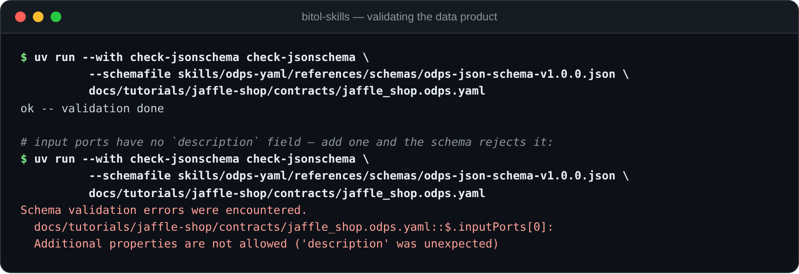

# Tutorial 3: Package the jaffle shop as a data product (`odps-yaml`)

Tutorials [1](odcs-yaml.md) and [2](odcs-python.md) produced contracts for the
two marts, and the raw layer has one too
([`jaffle-shop-raw.odcs.yaml`](jaffle-shop/contracts/jaffle-shop-raw.odcs.yaml)).
Three well-specified datasets, but nothing that says *"these belong together,
this team ships them as one unit, here is what it consumes and what it
promises."* That's the job of the Open Data Product Standard: this tutorial
bundles the contracts into an ODPS v1.0.0 data product.

**Skill**: [`odps-yaml`](../../skills/odps-yaml/). It teaches your
agent the product mental model, above all that ODPS ports are *references to
contracts*, not places to redefine schema.

**You need**: nothing running. ODPS files reference contracts by ID, so you
can follow along with just the repo. Having done tutorial 1 helps.

The finished product is committed at
[`jaffle-shop/contracts/jaffle_shop.odps.yaml`](jaffle-shop/contracts/jaffle_shop.odps.yaml).

> **Ask your agent** (with `odps-yaml` installed):
> *"Create an ODPS v1.0.0 data product for the jaffle shop: it consumes the
> raw contract and exposes the orders and customers contracts in
> docs/tutorials/jaffle-shop/contracts/ as output ports, with lineage."*

## 1. The mental model: a product is a thin wrapper

An ODPS data product declares *ports*, and every port is a named reference
to an ODCS contract via `contractId`:

- Input ports are expectations: data the product needs from upstream.
- Output ports are promises: data the product offers to consumers.
- Management ports are the control plane: endpoints to observe or control
  the product.

Schema, quality, SLA, server bindings? Those stay in the contracts. If you
catch yourself writing a column name into an ODPS file, you've drifted a
standard too far up the stack.

For the jaffle shop, the wiring looks like this (same diagram as the
[setup](README.md); this tutorial is about the purple box at the bottom):


## 2. Fundamentals

Create `jaffle_shop.odps.yaml`. The opening looks familiar from ODCS. Note
the different `kind`, and that ODPS v1.0.0 requires only `apiVersion`,
`kind`, `id`, and `status`:

```yaml
apiVersion: v1.0.0
kind: DataProduct
id: 72b5c5fd-c7ee-4124-874f-c40626a306db
name: Jaffle Shop
version: 1.0.0
status: active

domain: jaffle-shop
tenant: JaffleShopInc

description:
  purpose: Customer and order analytics for the jaffle shop, built from the shop's operational database.
  limitations: Batch product refreshed daily; no intra-day freshness. Amounts in USD only.
  usage: Consume the output ports via the linked data contracts.
```

## 3. Input ports: what the product expects

The product consumes one upstream dataset, the raw replication described by
tutorial 1's multi-object contract:

```yaml
inputPorts:
  - name: jaffle-shop-raw
    version: 1.0.0
    contractId: 8c45d6b0-2a11-44c1-8fa2-5213e3472920   # jaffle-shop-raw.odcs.yaml's id
    tags: [raw]
```

Two things worth pausing on:

- `contractId` is the whole point. The port carries a name and a pointer;
  everything about the data (three tables, foreign keys, cents-not-dollars) is
  in the contract it references.
- Input ports have no `description` field. That's an output-port field: put
  a description on an input port and strict validation fails with
  `Additional properties are not allowed ('description' was unexpected)`. The
  reference already describes itself: read the contract. (The docs say ports
  are keyed by *(name, version)*; during a migration the same port name can
  legitimately appear twice with different versions and contract IDs.)

## 4. Output ports: what the product promises

One port per mart, each pointing at its contract, plus lineage:
`inputContracts` records exactly which upstream contracts each output was
built from:

```yaml
outputPorts:
  - name: orders
    description: One row per order with amounts pivoted per payment method.
    type: tables
    version: 1.0.0
    contractId: 8f8e7b5a-5fd8-4d35-bd8e-1177136c034b   # orders.odcs.yaml (tutorial 1)
    inputContracts:
      - id: 8c45d6b0-2a11-44c1-8fa2-5213e3472920
        version: 1.0.0
  - name: customers
    description: One row per customer with order history rolled up.
    type: tables
    version: 1.0.0
    contractId: 7fb49248-5e36-486d-a110-d7edcf2b2e84   # customers.odcs.yaml (tutorial 2)
    inputContracts:
      - id: 8c45d6b0-2a11-44c1-8fa2-5213e3472920
        version: 1.0.0
```

Notes that save validation round-trips:

- `type` is a free-form hint (`tables`, `topic`, `file`, …); v1.0.0 doesn't
  enumerate it.
- The prose spec marks output-port `version` optional, but the JSON Schema
  *requires* it (same for `contractId` on input ports). Include both,
  always.
- Output ports may also carry an `sbom`, a link to a bill of materials for
  the code that builds the port. Overkill for a tutorial; see the skill's
  vendored `customer-data-product.odps.yaml` example if you need it.

## 5. Management ports, support, team

The control plane: where operators check on the product. `content` must be
one of `discoverability`, `observability`, or `control`; `type` is `rest`
(default) or `topic`:

```yaml
managementPorts:
  - name: mart-freshness-metrics
    content: observability
    type: rest
    url: https://data.jaffleshop.example/products/jaffle-shop/metrics
    description: Freshness and quality-check results for both marts.
```

Support and team mirror what you wrote in the ODCS contracts (deliberately
so: RFC 0016 aligned ODPS's team-as-object shape with ODCS v3.1.0):

```yaml
support:
  - channel: "#jaffle-shop-data"
    tool: slack
    scope: interactive
    url: https://jaffleshop.example.slack.com/archives/C000JAFFLE

team:
  name: jaffle-analytics
  description: Analytics engineering team owning the jaffle shop marts.
  members:
    - username: alice@jaffleshop.example
      name: Alice Ordway
      role: owner
      dateIn: "2018-01-01"

productCreatedTs: "2018-01-01T09:00:00Z"
```

## 6. Validate

The `odps-yaml` skill vendors the v1.0.0 JSON Schema, so validation is one
command from the repo root (`check-jsonschema` reads YAML natively):

```bash
uv run --with check-jsonschema check-jsonschema \
    --schemafile skills/odps-yaml/references/schemas/odps-json-schema-v1.0.0.json \
    docs/tutorials/jaffle-shop/contracts/jaffle_shop.odps.yaml
```

```text
ok -- validation done
```



Try the failure from step 3 for yourself: add `description: raw tables` to
the input port and rerun; the schema rejects it. (One caveat the skill flags:
for ODPS, the JSON Schema is a *companion* to the prose spec, and in a couple
of places stricter than it. When they disagree, the docs win, but passing the
schema keeps every tool happy.)

## 7. Walk it like a consumer

The payoff of the whole stack is the discovery path. A consumer who finds this
product needs three hops to reach a queryable table, without any tribal
knowledge:

1. The product's `outputPorts[0]` promises `orders` via contract
   `8f8e7b5a-…034b`.
2. That contract ([`orders.odcs.yaml`](jaffle-shop/contracts/orders.odcs.yaml))
   declares the schema, quality promises, SLA, and a `duckdb` server binding:
   `jaffle_shop.duckdb`, schema `main`.
3. The data itself:

```sql
-- duckdb jaffle-shop/jaffle_shop.duckdb
SELECT status, COUNT(*) AS orders, SUM(amount) AS revenue
FROM orders GROUP BY status ORDER BY revenue DESC;
```

And the lineage answers the follow-up question ("where does this come
from?"): `inputContracts` points at the raw contract, whose `relationships`
map the foreign keys between the three source tables.

## Recap

You packaged three contracts into a data product: an input port declaring the
upstream expectation, two output ports promising the marts with lineage back
to their input, a management port for observability, and shared support and
team sections. You validated it against the vendored schema and hit the
standard's one sharp edge (no `description` on input ports) firsthand.

More prompts to try against your `odps-yaml`-equipped agent:

> *"We're releasing a breaking orders v2 with amounts in cents. Update the
> product so v1 and v2 run side by side during migration."*
> *(expect: a second `orders` output port with `version: 2.0.0` and a new
> contractId; same name, both listed)*
>
> *"Which contract does the customers output port promise, and what SLA does
> it inherit?"* *(expect: none from ODPS; SLAs live in the contract)*
>
> *"Add a control management port for triggering a mart rebuild."*

That's all three skills: contracts by hand, contracts from code, and the
product that ties them together.
